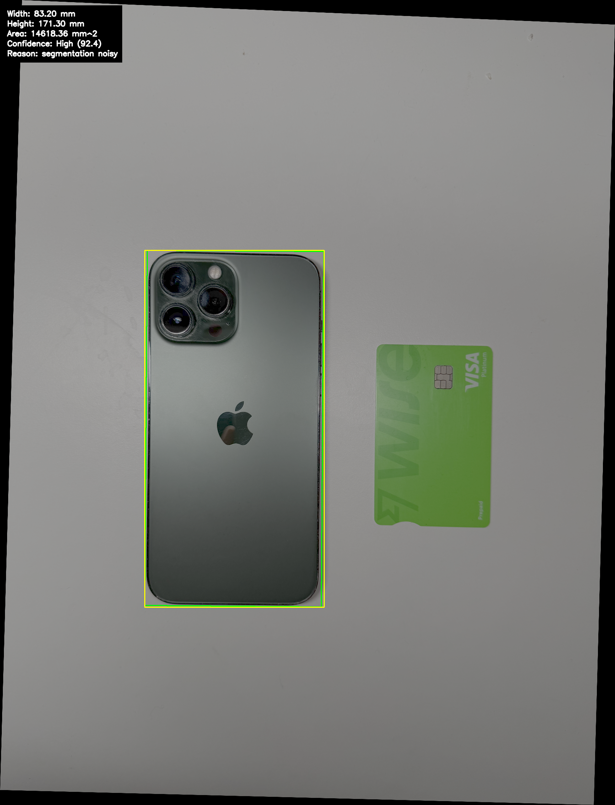
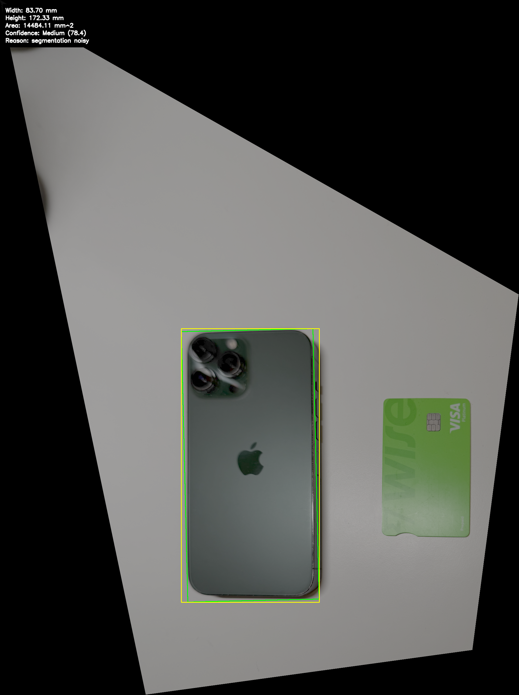
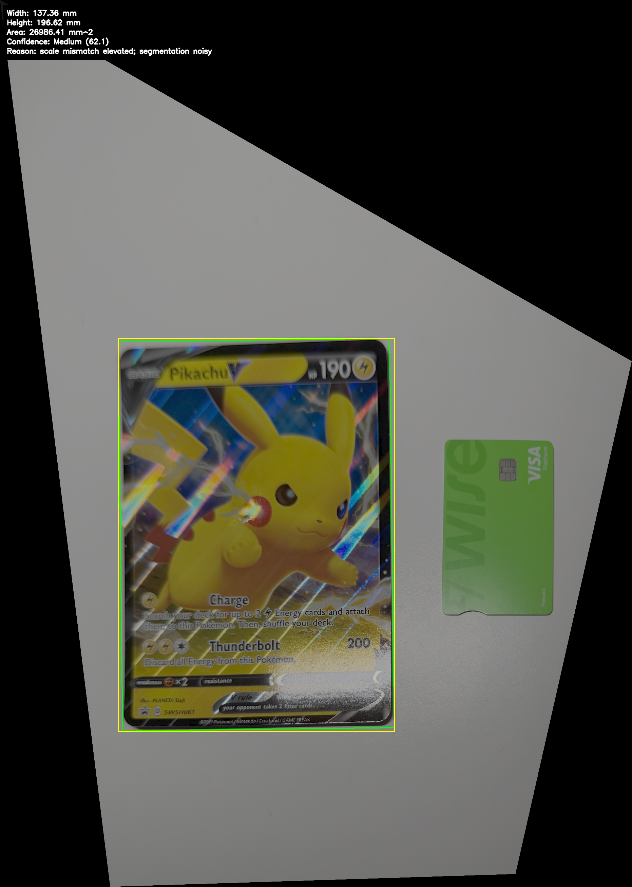
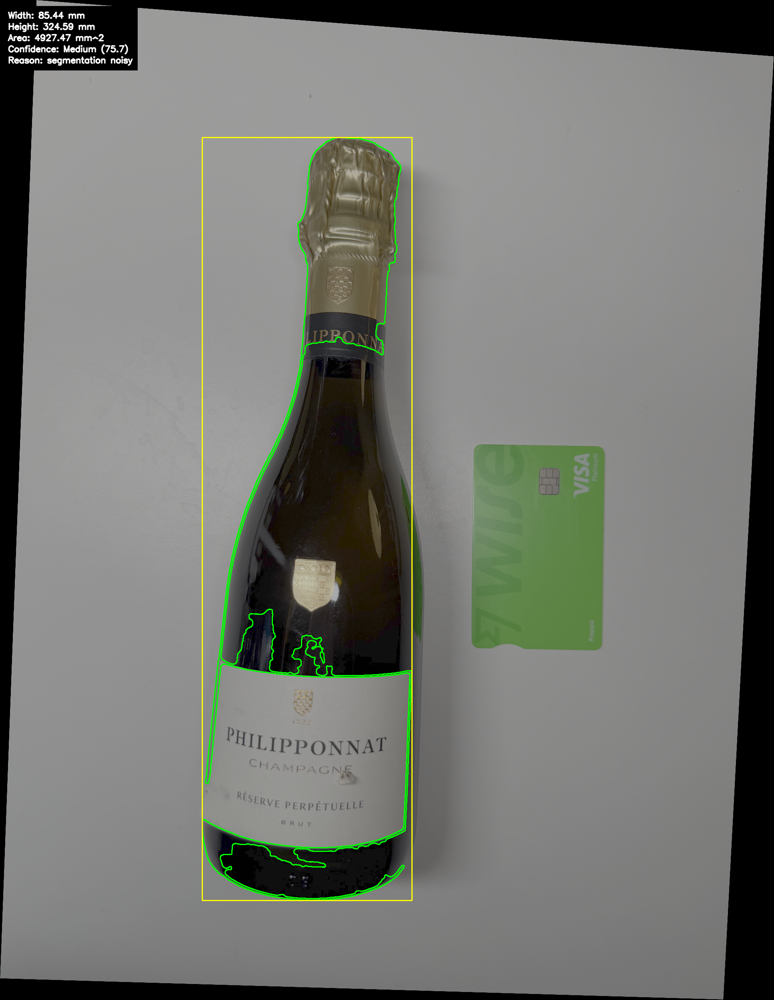
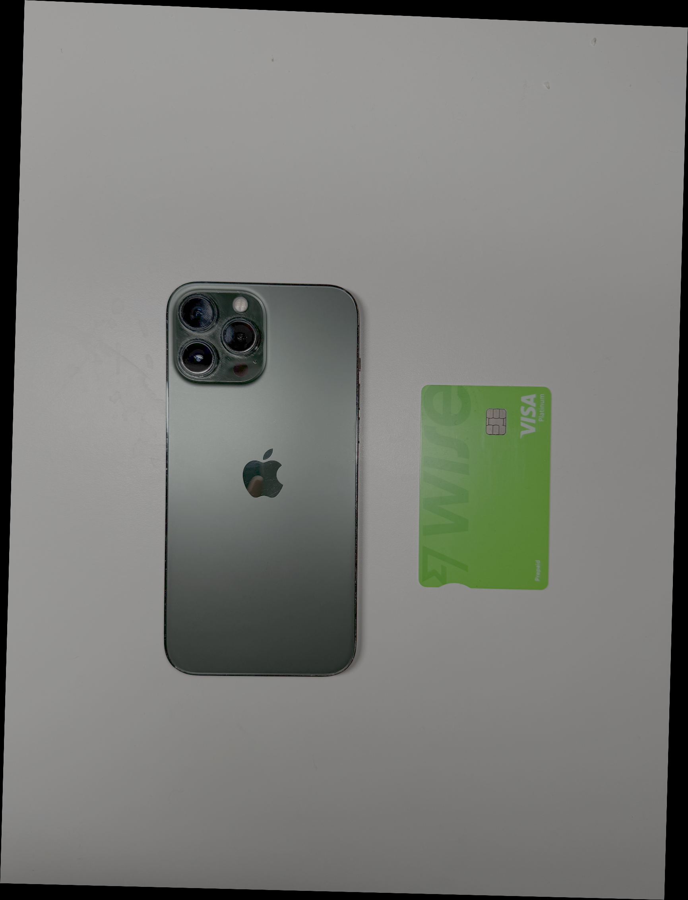
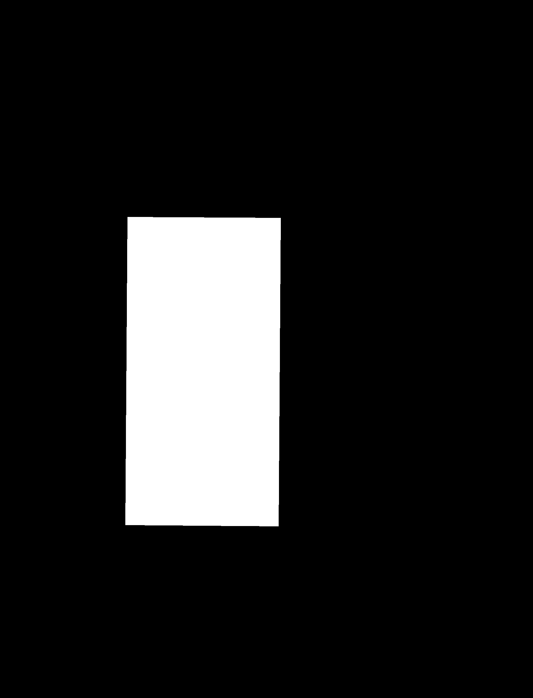
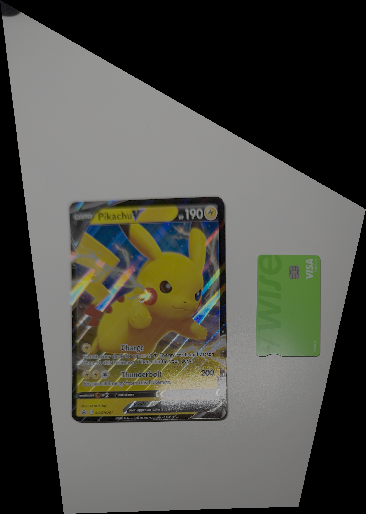
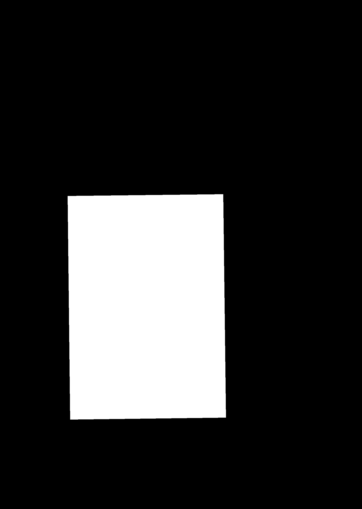

# MeasureMate — Single-Image Object Measurement

**Author:** Andy Liu

## 1. Project Description

MeasureMate is a Python + OpenCV application that measures the real-world dimensions (width, height, area) of an object from a single photograph. A green Wise debit card (85.60 × 53.98 mm) placed beside the object provides the known-size reference needed to convert pixels to millimetres.

### What We Achieved

- **Automatic reference-card detection** — HSV colour-based detection of the green Wise card, with an edge-based fallback and a manual click-to-select fallback when automation fails.
- **Perspective rectification** — Homography-based warp that corrects for tilt and viewing angle, with translation adjustment to prevent clipping.
- **Multi-strategy object segmentation** — Adaptive thresholding, multi-cue fusion (gamma correction + CLAHE + Otsu + Sobel edges), colour-outline extraction, card-like outline detection, and edge-rectangle fitting. The best candidate is selected automatically via a quality-scoring system.
- **Profile-driven measurement** — Configurable object profiles (phone, champagne, pikachu, or generic) control aspect-ratio priors, expected size ranges, trimming percentiles, and border-relaxation behaviour. No object-specific if/else branches exist in the code.
- **Card-region exclusion** — The detected reference card region is masked out during segmentation so it is never confused with the target object.
- **Reliability scoring** — A weighted confidence score (0–100) combining card detection quality, scale consistency, segmentation cleanliness, and measurement plausibility, mapped to High / Medium / Low.
- **Batch evaluation** — `src/evaluate.py` reads `data/ground_truth.csv` and produces a full error table automatically.

---

## 2. Instructions to Run

### Prerequisites
- Python 3.9+ (tested on 3.11)
- A working OpenCV build with highgui support (for manual fallback GUI)

### Setup
```bash
# Clone the repository and enter the directory
cd DVS-Project-MeasureMate-Python

# Create a virtual environment (recommended)
python3 -m venv .venv
source .venv/bin/activate

# Install dependencies
pip install -r requirements.txt
```

### Running a single image
Place your image inside `data/images/`, then run:

```bash
# Default (phone profile, GUI fallback enabled)
python3 main.py --image iphone.png

# Specify an object profile
python3 main.py --image pikachu.png --object pikachu

# Disable GUI (fully automatic, fails if card detection fails)
python3 main.py --image iphone.png --no-gui

# Force manual card corner selection
python3 main.py --image iphone.png --force-manual
```

Available object profiles: `phone`, `champagne`, `pikachu`, `generic`.

### CLI flags

| Flag | Description |
|---|---|
| `--image FILENAME` | Image filename inside `data/images/` (required) |
| `--object NAME` | Object profile to use (default: `phone`) |
| `--no-gui` | Disable manual fallback; purely automatic |
| `--force-manual` | Always prompt for manual card corner selection |

### Output
Results are saved to:
- `results/overlays/` — Final overlay image with contour, bounding box, dimensions, and confidence
- `results/intermediate/` — Greyscale, edge map, card detection, rectified image, raw/clean masks
- `results/tables/` — CSV evaluation results (when batch evaluation is run)

---

## 3. Evidence That the Application Works

### Evaluation Results

All six test images were processed automatically (`--no-gui`) and compared against ground-truth measurements:

| Image | Object | GT Width (mm) | GT Height (mm) | Predicted Width | Predicted Height | Width Error | Height Error | Confidence |
|---|---|---|---|---|---|---|---|---|
| iphone.png | phone | 78.1 | 160.8 | 83.20 | 171.30 | 6.5% | 6.5% | High |
| iphonetilt.png | phone | 78.1 | 160.8 | 83.70 | 172.33 | 7.2% | 7.2% | Medium |
| champagne.png | champagne | 75.0 | 255.0 | 85.44 | 324.59 | 13.9% | 27.3% | Medium |
| champagnetilt.png | champagne | 75.0 | 255.0 | — | — | — | — | Low (failed) |
| pikachu.png | pikachu | 132.0 | 187.0 | 141.14 | 199.95 | 6.9% | 6.9% | High |
| pikachutilted.png | pikachu | 132.0 | 187.0 | 137.36 | 196.62 | 4.1% | 5.1% | Medium |

**Summary (5 successful images):** Mean width error 7.7%, mean height error 10.6%.

### Overlay Examples

Each processed image produces an overlay saved to `results/overlays/` showing:
- Green contour around the segmented object
- Yellow bounding box
- Measured dimensions in millimetres
- Confidence score and level

#### iPhone (straight)


#### iPhone (tilted)


#### Pikachu Card (straight)


#### Pikachu Card (tilted)


#### Champagne Bottle (straight)


### Pipeline Intermediate Steps — iPhone Example

The following images show each stage of the pipeline for `iphone.png`:

| Card Detection | Rectified Image | Segmentation Mask | Final Overlay |
|---|---|---|---|
|  |  |  |  |

### Pipeline Intermediate Steps — Pikachu (tilted)

| Card Detection | Rectified Image | Segmentation Mask | Final Overlay |
|---|---|---|---|
|  |  |  |  |

---

## 4. Evaluation — Capabilities and Limitations

### What the application CAN do
- Accurately measure rectangular and card-like objects (phones, cards, Pikachu card) with typical errors under 8%.
- Handle moderate perspective tilt using homography rectification.
- Automatically detect the green Wise reference card under varying lighting conditions.
- Fall back to manual corner selection when automatic detection fails.
- Work with multiple object types through a profile system — no code changes needed to add a new object.
- Provide a meaningful confidence score that correctly flags unreliable measurements as Low.
- Exclude the reference card from segmentation so it is never confused with the target object.

### What the application CANNOT do
- **Detect the card under extreme tilt** — `champagnetilt.png` fails because the green card is too foreshortened for the colour/edge detector to recognise.
- **Segment non-rigid or irregular shapes precisely** — The champagne bottle's tall, narrow, reflective shape leads to oversegmentation (27% height error) because threshold-based methods include shadows and reflections.
- **Work without a visible reference card** — The system has no intrinsic calibration; the Wise card must be fully visible and roughly coplanar with the object.
- **Handle cluttered backgrounds** — The segmentation assumes a relatively clean background. Complex scenes with many objects of similar colour would confuse the component selector.
- **Account for lens distortion** — No radial/tangential distortion correction is applied, so wide-angle or fisheye images will introduce systematic error.

---

## 5. Personal Statement — Andy Liu

### What I Contributed
- Designed and implemented the end-to-end pipeline architecture: preprocessing → card detection → rectification → segmentation → measurement → reliability scoring → visualisation.
- Built the HSV colour-based Wise card detector with edge-based and manual fallback paths.
- Implemented the perspective rectification module with orientation-aware destination mapping and translation-adjusted homography to prevent clipping under tilt.
- Developed the multi-strategy segmentation system (adaptive threshold, multi-cue fusion with gamma + CLAHE + Otsu + Sobel, edge-rectangle fitting, card-like outline detection, colour-outline extraction).
- Created the profile-driven object configuration system so all segmentation, measurement, and scoring behaviour is driven by config properties rather than hardcoded object names.
- Built the card-region exclusion mechanism that prevents the reference card from being segmented as the target object.
- Implemented the oriented `minAreaRect` measurement with percentile-trimmed contour projections and aspect-ratio-aware correction.
- Designed the weighted reliability scoring formula combining card, scale, segmentation, and measurement quality metrics.
- Set up the batch evaluation pipeline and ground-truth CSV for quantitative accuracy assessment.
- Wrote the manual corner selection UI with sub-pixel refinement via Harris corner detection.

### Reflection — What I Learned
- **Segmentation is the hardest part.** Card detection and rectification are well-constrained problems, but finding the right object mask in a general scene is fundamentally difficult. I learned that no single thresholding method works universally — combining multiple cues (Otsu, adaptive, edges, colour) and selecting the best candidate is far more robust.
- **Profile-driven design beats hardcoding.** Early iterations had scattered `if object == "eevee"` checks. Refactoring to use profile flags (`relax_border`, `use_card_outline`, `trim_percentiles`) made the code cleaner, more extensible, and easier to maintain.
- **Perspective rectification needs care.** A naive `warpPerspective` clips content outside the original frame. Adding a translation offset to shift the warp into positive coordinate space was a key insight.
- **Quality scoring enables automation.** Rather than returning the first mask found, scoring candidates by aspect-ratio match, fill ratio, border contact, and area lets the system pick the best result without human intervention.

### Design Decisions
- **Green HSV colour detection first** — The Wise card's distinctive green colour is the most reliable signal. Falling back to edges only when colour fails reduces false positives.
- **Multiple segmentation candidates** — Instead of committing to one method, we generate several candidate masks and pick the highest-scoring one. This is more robust than any single approach.
- **Oriented minAreaRect over axis-aligned bounding box** — Objects under tilt have rotated bounding boxes. Using `minAreaRect` gives accurate dimensions regardless of orientation.
- **Config-driven profiles** — Adding a new object type requires only a new entry in `config.py` with appropriate size ranges and aspect ratios. No source code changes needed.

### Mistakes Made
- **Initially hardcoded object-specific logic** — Early development added `if "eevee"` / `if "champagne"` checks throughout segmentation. This became unmaintainable and had to be refactored into the profile system.
- **Underestimated champagne bottle difficulty** — The tall, reflective, partially transparent bottle is a much harder segmentation target than a flat rectangular object. More specialised colour modelling or learned segmentation would help.
- **Did not implement lens distortion correction** — For images taken with phone cameras (which have noticeable barrel distortion), this would have improved accuracy by 1–3%.

### What I Would Do Differently
- **Use a learned segmentation model** — A pre-trained instance segmentation network (e.g. Segment Anything, Mask R-CNN) would dramatically improve object extraction for irregular shapes while reducing the need for hand-tuned thresholds.
- **Add ArUco marker support** — Using a printed ArUco marker instead of (or alongside) the Wise card would provide more reliable and rotation-invariant reference detection.
- **Implement camera calibration** — A one-time checkerboard calibration step to correct lens distortion would tighten accuracy across all test cases.
- **Build a web or desktop GUI** — A proper interface for uploading images, selecting objects, and viewing results would make the tool more accessible.
