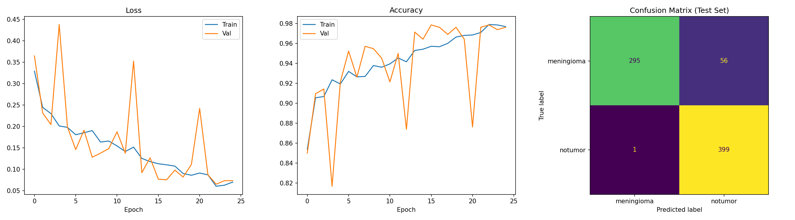
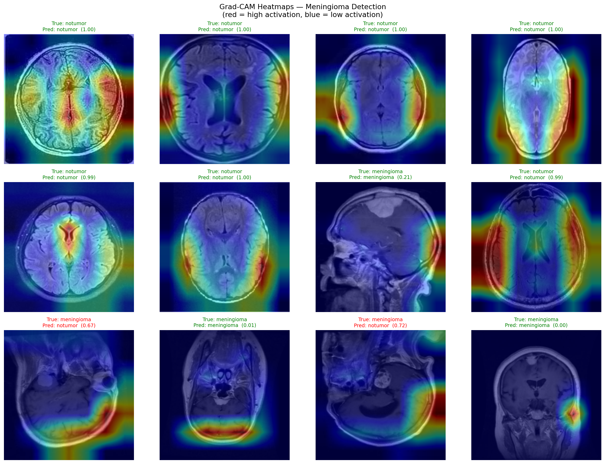
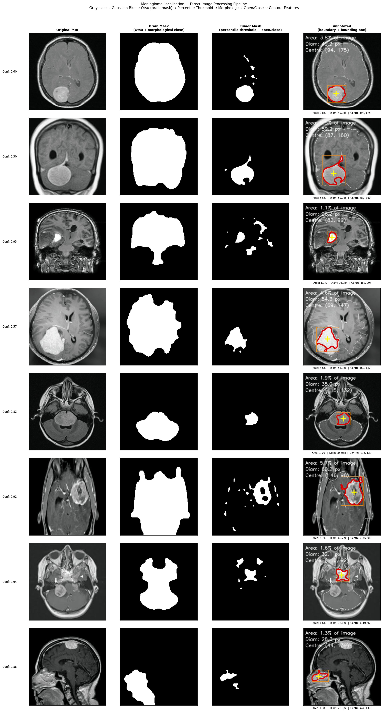

# Meningioma Brain Tumour Detection & Localisation

**Design of Visual Systems — Imperial College London, Year 4**

Harvey Gould

---

## What Was Achieved

We built a two-stage visual pipeline that:

1. **Classifies** brain MRI images as *meningioma* (tumour present) or *no tumour* using a custom Convolutional Neural Network trained entirely from scratch — no pretrained weights.
2. **Localises** the tumour in confirmed positive cases using classical image processing: Gaussian blur, Otsu thresholding, morphological opening (to strip the skull ring), morphological closing, contour detection and image moments.

Additionally, **Grad-CAM** is used to visualise which regions of the image the CNN focused on, providing an interpretable heatmap overlay.

---

## How to Run

### Requirements

```bash
python -m pip install torch torchvision scikit-learn matplotlib opencv-python
```

> **GPU:** PyTorch with CUDA is strongly recommended. To install the CUDA build:
> ```bash
> python -m pip install torch torchvision --index-url https://download.pytorch.org/whl/cu128
> ```

### Dataset

Place the Kaggle Brain Tumour MRI Dataset in the project root with this structure:

```
Project/
├── Training/
│   ├── meningioma/
│   └── notumor/
├── Testing/
│   ├── meningioma/
│   └── notumor/
```

### run individual scripts

```bash
# 1. Train the CNN (saves best_model.pth, results.png)
python train.py

# 2. Grad-CAM heatmap visualisation (requires best_model.pth)
python gradcam.py

# 3. Tumour localisation — classical pipeline (requires best_model.pth)
python localize.py
```

---

## Evidence

### Classification Results

Training was run for 25 epochs on an NVIDIA RTX 5070 GPU.



### Grad-CAM Heatmaps

The network's attention overlaid on test images. Red regions indicate where the CNN focused most when making its prediction.



### Tumour Localisation

For each true positive (correctly predicted meningioma), the pipeline produces:
- A brain mask (skull stripped via morphological opening)
- A tumour mask (top 12% brightest pixels within the brain, cleaned with open/close)
- An annotated image with tumour boundary (red), bounding box (orange), and centroid (yellow cross)

Measurements reported: area as % of image, equivalent diameter in pixels, centroid coordinates.



---

## Evaluation

### What it can do
- Reliably classify meningioma vs. no-tumour MRI scans with high accuracy
- Provide a visual explanation of CNN predictions via Grad-CAM
- Estimate the location (centroid), boundary and relative size of tumours in correctly classified images
- Work on axial, coronal and sagittal MRI orientations

### What it cannot do
- Distinguish tumour types — trained only on meningioma vs. no-tumour
- Report tumour size in physical units (mm) — measurements are in pixels relative to the 224×224 resized image
- Reliably localise low-contrast or small tumours where intensity is similar to surrounding tissue
- Handle MRI scans with atypical skull geometry or very bright backgrounds where the brain mask may fail

### Design Decisions
- **CNN from scratch** rather than using a pretrained model, to demonstrate understanding of convolutional architecture (Conv2D, BatchNorm, ReLU, MaxPool, Global Average Pooling)
- **Morphological opening for skull stripping**: the skull ring is a thin bright structure; opening with a kernel larger than the skull thickness naturally erodes it away while the larger brain blob survives — a principled use of the technique
- **Circularity-weighted contour selection**: rather than selecting the largest contour (which can be a skull crescent arc), contours are scored by area × circularity, favouring compact round blobs over elongated artefacts

---

## Personal Statement

### Harvey Gould

For this project I was responsible for the full implementation — designing and training the CNN, building the Grad-CAM visualisation, and developing the classical image processing localisation pipeline.

I decided early on to use Python rather than MATLAB, mainly because the deep learning ecosystem (PyTorch, scikit-learn). In hindsight that was the right call, though it did come with some setup friction. Getting CUDA working took longer than expected — the default pip install torch installed a CPU-only build, and it was only after running nvidia-smi that I realised my RTX 5070 wasn't being used at all. Once I pointed PyTorch at the correct CUDA 12.8 wheel it trained significantly faster.

I designed the CNN architecture with the assistance of AI, making five convolutional blocks each following the Conv → BatchNorm → ReLU → MaxPool pattern, finishing with global average pooling before the classifier head. I avoided using pretrained weights with the goal of creating a custom tumor detection system myself, starting with the classification of tumors and then the location detection. The model ended up at around a million parameters and converged well within 25 epochs.

The localisation felt most relevant to the work I had done throughout this term in labs. My initial approach used Grad-CAM heatmaps as input to the classical segmentation, but I quickly noticed it was identifying regions outside the skull or brain — the heatmap wasn't spatially precise enough to be reliable for segmentation. I switched to working directly on the MRI images instead.

The brain masking took the most iteration. I tried flood filling from the image corners to strip the background, but this backfired. If there was any connected path from a corner to the brain region, the whole mask would be wiped out. The approach that actually worked came from just looking at the images more carefully: the skull is a thin bright ring separated from the brain by a dark gap, which is exactly what morphological opening is designed to exploit. Using a 15px opening kernel removes the skull ring (too thin to survive the erosion) while the larger brain blob shrinks but remains. That was a satisfying moment where the theory from lectures translated directly into a practical fix.

If I were to do this again I'd probably spend more time on the localisation before submitting — in particular, the brain mask occasionally fails on sagittal slices where the head geometry is quite different from axial/coronal views. A more robust approach might involve fitting an ellipse to the brain contour rather than just taking the largest blob. I'd also try to report tumour size in physical units by using the known DICOM voxel spacing, rather than pixel counts relative to a resized image.
